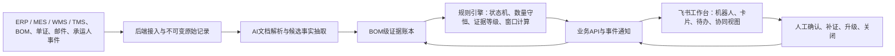
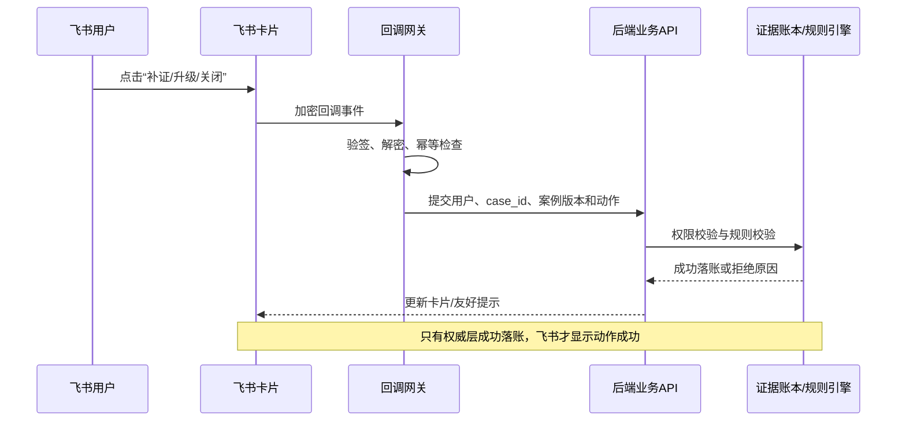

# BOM交付守门人：项目方案与飞书集成

## 1. 材料声明

本方案面向“AI + 物料全过程跟踪”命题，使用人工构造的模拟项目、模拟人员、模拟单证和模拟物流事件说明产品逻辑，不代表明珞股份真实系统、真实客户、真实物流或已经取得的实施成果。文中涉及的飞书机器人、消息卡片、多维表格、审批、任务及开放 API 能力，均为 **MVP 拟接入能力**，需在应用权限审批、接口联调和验收测试完成后才能视为上线能力。

## 2. 项目定位

现有物流可视化通常以运单、集装箱或节点为中心，难以直接回答项目经理最关心的四个问题：

1. 哪个 BOM 关键物料已经走到哪一步？
2. 当前结论由哪份单证、哪段原文或哪个业务系统事件支撑？
3. 延误会影响哪个设备模块或安装节点？
4. 最晚何时必须干预、由谁处理、需要补什么证据？

“BOM交付守门人”在 ERP、MES、WMS、TMS 与外部物流数据之上增加轻量 AI、证据账本和确定性规则层，把跨厂、关务、海运事件反向映射到具体 `project_id + bom_version + bom_line_id`，形成可追溯、可复算、可协同的 BOM 级交付风险闭环。

系统不替换既有业务系统，不替代报关员进行 HS 编码归类或合规判断，也不在小样本阶段宣称具备可靠的 ETA 预测能力。

## 3. 总体架构与权威边界



系统采用清晰的“双层责任”设计：

| 层级 | 定位 | 可以做 | 不可以做 |
| --- | --- | --- | --- |
| 后端 API、证据账本、规则引擎 | **业务权威层** | 保存原始文档哈希和证据事实；维护 BOM、事件与版本关系；执行数量守恒、状态机、证据等级和窗口计算；记录改判、撤销及审计日志 | 不因飞书卡片点击直接覆盖原始证据；不让大模型单独决定最终状态 |
| 飞书 | **前端工作台与协同编排层** | 向责任人推送风险；展示后端返回的状态、证据摘要和窗口；收集人工处理意图；组织审批、任务、催办和群内协同 | 不作为最终事实库；不在多维表格或卡片内复制一套独立规则；不把按钮回调当作业务操作已成功 |

后端生成唯一 `case_id`、`event_id`、`evidence_id` 和规则版本。飞书侧只保存必要的展示索引及协同状态。人工在飞书发起“确认、补证、升级、关闭”等动作后，后端必须再次校验权限、案例版本、必填字段和证据完整性；只有后端成功落账，飞书卡片才更新为完成状态。

## 4. 数据对象与关键规则

### 4.1 核心对象

| 对象 | 核心标识 | 作用 |
| --- | --- | --- |
| 项目与 BOM | `project_id`, `bom_version`, `bom_line_id` | 防止同一物料跨项目、跨版本或跨模块串账 |
| 物流事件 | `event_id`, `event_type`, `event_time`, `received_time` | 分离业务发生时间与系统获知时间 |
| 来源与证据 | `source_document_id`, `evidence_id`, `original_text`, `source_document_hash` | 让每个结论可回到原始文件、页码或邮件段落 |
| 干预案例 | `case_id`, `latest_action_time`, `case_status` | 保存责任人、SLA、升级路径、关闭原因和关闭证据 |

### 4.2 状态与证据

状态至少区分 `planned`、`predicted`、`confirmed`、`conflict`、`unknown`、`corrected` 和 `revoked`。模型抽取置信度表示“抽取得是否稳定”，证据等级表示“来源能否证明业务事实”，两者不能合并成一个分数。例如，“预计装船”即使抽取置信度很高，也不能确认“已经装船”。

规则引擎按 BOM 行执行：

```text
BOM需求量 -> 已确认出库量 -> 已确认装箱量 -> 发票量 -> 报关量 -> 已确认装船量 -> 签收量
```

部分装运需要按批次汇总；一料多箱和一箱多料均需显式映射；单位不一致时先执行版本化换算，无法换算则进入人工复核。更正资料以新事件指向旧事件，不覆盖历史记录。

### 4.3 最迟干预窗口

```text
最迟干预时间 = 模块需求时间 - 采取动作后的剩余运输时间 - 动作耗时 - 安全缓冲
剩余干预窗口 = 最迟干预时间 - 当前快照时间
```

计算结果绑定业务日历、时区、参数版本和规则版本，以支持复算。窗口小于零时，不再给出“继续等待”的普通建议，而是提示升级运输、拆分关键件或调整安装计划，并由有权限的业务负责人决策。

## 5. 主演示案例

演示使用统一模拟时钟 `2026-08-09 16:00`。欧洲项目 A 的电控柜对应 `BL-1001`，商业发票和装箱单数量均为 4，进口报关草单数量为 3，且尚无放行证据。该物料影响“机器人工作站 3”，模块需求时间为 `2026-08-20 08:00`，补充申报的最迟行动时间为 `2026-08-10 10:00`，剩余窗口为 18 小时。

主演示流程如下：

1. 后端接收装箱单、发票、报关草单和承运人事件，AI抽取物料、数量、箱号、地点、状态、时间、原文位置及置信度。
2. 规则层将候选事实映射到 `BL-1001`，发现数量 `4 / 4 / 3` 不守恒，输出 `customs_quantity_conflict`，停止自动确认。
3. 后端生成高风险 `case_id`，返回受影响模块、剩余 18 小时、责任角色、证据清单和建议动作。
4. MVP 拟由飞书应用机器人向关务责任人和项目经理推送交互卡片；卡片显示事实摘要、截止时间和后端证据链接，不把摘要当作原始凭证。
5. 责任人可拟在卡片中选择“领取处理”“补充证据”“升级协调”或“查看详情”。点击只提交操作意图，后端落账成功后才更新卡片。
6. 用户触发“延误 3 天”推演时，后端把剩余运输时间增加 72 小时并重新计算受影响模块和窗口；飞书仅展示重算结果。
7. 更正回执到达后，后端以 `supersedes_event_id` 保留改判链；人工核验通过并满足关闭条件后，飞书卡片拟更新为“已关闭”，同时展示关闭证据编号。

## 6. 跨厂—关务—海运端到端链路

| 阶段 | 代表事件与证据 | 后端权威处理 | 飞书 MVP 拟承担的协同动作 |
| --- | --- | --- | --- |
| 供应与厂区 | 采购确认、供应商 ASN、完工、质检放行、库存预留、出库 | 关联 BOM 版本和数量，检查上游条件 | 向采购、质量或厂区物流责任人提示缺证和超时 |
| 跨厂调拨 | 调拨出库、到达、重新装箱、一料多箱/一箱多料 | 维护包装映射、单位换算和事件顺序 | 在项目群展示跨厂节点摘要，拟生成责任待办 |
| 关务 | 发票、装箱单、报关草单、申报回执、查验、放行、更正 | 执行跨单证一致性与证据等级校验；专业归类仍由报关人员负责 | 对数量冲突、缺字段、临近窗口拟推送卡片并催办 |
| 海运 | 订舱、装船、ETA、到港、末端签收 | 区分计划、预测与实际；维护承运人源健康和沉默异常 | 在工作台展示关键件时间线，拟向货代/项目经理路由异常 |
| 安装交付 | 现场收货、安装领用、模块齐套 | 计算模块影响，凭关闭证据完成案例闭环 | 汇总未闭环案例和模块风险，不在飞书侧自行计算齐套率 |

当预期回执缺失时，后端同时检查预期时间、上游条件、来源最后更新时间和接口健康。只有“节点已超时、上游已就绪、数据源健康”同时成立，才判断为业务停滞；接口异常则显示“来源待恢复”，避免错误催办业务人员。

## 7. 飞书 MVP 拟接入设计

### 7.1 应用形态

拟采用企业自建应用，包含应用机器人、消息卡片、事件订阅回调和工作台入口。多维表格、审批或任务能力只在验证确有必要后按最小范围接入，不预设全部启用。

### 7.2 API 类别

| API / 能力类别 | MVP 拟用场景 | 数据与权限边界 |
| --- | --- | --- |
| 身份与通讯录 | 将后端责任角色映射到飞书用户或部门 | 只读取业务必需的用户标识和组织关系；敏感通讯录权限需管理员审批 |
| IM 消息与应用机器人 | 单聊或群聊推送风险摘要、补证请求和处理结果 | 卡片不承载完整敏感单证；消息发送失败进入后端重试或备用通知队列 |
| 消息卡片与卡片回调 | 领取、补证、升级、确认关闭、查看详情 | 回调需验签/解密、鉴权、幂等；按钮回调不是最终业务事实 |
| 多维表格 | 可选的轻量协同看板或人工维护责任矩阵 | 仅同步必要字段和后端 ID；不得成为证据账本或窗口计算权威源 |
| 审批 / 任务 | 可选的高风险升级、例外放行或责任待办 | 由后端保存业务案例状态；飞书流程 ID 作为协同关联号 |
| 云文档 / 文件链接 | 可选的项目说明、处理指引和脱敏附件入口 | 原始单证优先留在受控后端对象存储；链接使用短期授权和访问审计 |
| 事件订阅 | 接收机器人消息、卡片操作及可选流程状态变化 | 验证 verification token 或 Encrypt Key；事件重复推送必须幂等处理 |

具体 scope、接口版本、字段结构及调用频率，以飞书开放平台联调时的最新文档和管理员审批结果为准。

### 7.3 认证与调用约束

- 服务端调用应用权限接口时拟使用 `tenant_access_token`，由官方 SDK 缓存并提前刷新，禁止每次请求重新获取。
- 涉及用户身份或明确要求用户授权的接口，拟走 OAuth 流程获取 `user_access_token`；不能用应用 token 越权替代用户授权。
- `app_secret`、`encrypt_key`、verification token 等只存放在环境变量或密钥管理服务中，禁止写入前端、卡片 JSON 或仓库。
- 所有飞书 API 响应均检查业务 `code`；对 HTTP 429、临时错误和超时采用带抖动的指数退避，但不对明确的权限或参数错误盲目重试。
- 飞书事件可能重复、乱序或延迟。后端拟使用 `event_id / case_id + action + version` 作为幂等键，并以案例版本做乐观锁。
- 事件回调先完成验签、基础校验和可靠入队，再尽快返回；证据解析、规则计算和跨系统写入由异步任务完成。

### 7.4 一次卡片操作的完整闭环



## 8. AI、规则与人工边界

| 参与方 | 负责 | 明确不负责 |
| --- | --- | --- |
| AI | OCR 后的多语言事实抽取；物料别名、单位、地点和事件候选归一化；返回原文、位置、候选 BOM 行和不确定性 | 不直接确认已出库、已放行或已装船；不计算最终风险；不覆盖冲突证据 |
| 规则引擎 | 主键校验、事实模式门控、证据等级、数量守恒、状态顺序、沉默异常、影响传播和窗口计算 | 不替代报关、运输和项目负责人的专业决策 |
| 人工 | 处理候选不唯一、低置信度、单位无法换算、证据冲突和例外放行；提供关闭证据 | 不允许无理由覆盖原始记录；关键改判必须留痕 |
| 飞书 | 将后端结论送达正确的人，并承载协同意图和进度展示 | 不独立生成事实、风险等级或最终窗口 |

## 9. 异常处理与优雅降级

1. **飞书 API 暂时不可用**：后端案例仍正常生成并进入重试队列；达到阈值后告警，不丢失事件。恢复后补发最新状态，避免重复刷屏。
2. **卡片渲染失败**：降级为包含 `case_id`、风险摘要、截止时间和安全详情链接的纯文本消息。
3. **用户无权限或应用未获 scope**：返回明确的友好提示和管理员申请路径，不显示“处理成功”。
4. **后端规则计算超时**：卡片显示“正在核验，暂不可确认”，保留查询入口；不得用旧缓存冒充新结论。
5. **重复点击或重复事件**：幂等键返回上一次处理结果；案例版本已变化时要求刷新，不重复落账。
6. **证据或数据源异常**：显示“证据不足”或“来源待恢复”，而不是把未知状态误写为未发生。

## 10. MVP范围与验收口径

MVP 选择一个模拟欧洲项目、一版 BOM 和一条典型海运线路，本次计划以 50 至 100 个进一步扩充的人工构造模拟 BOM 节点、15 至 25 份模拟单证、邮件与事件资料开展验证。只有在后续企业明确授权、完成脱敏和权限评审后，脱敏历史资料才进入企业试点。当前小规模 CSV 和静态 Demo 仅用于展示数据关系与交互，不足以证明模型指标。

| 指标 | 待验证目标 | 测量方式 |
| --- | ---: | --- |
| 关键物料与 BOM 映射准确率 | 不低于 95% | 与人工标注固定样本比较 |
| 预置异常识别召回率 | 不低于 90% | 注入数量、时间、版本和缺证异常后统计 |
| 固定场景窗口计算一致率 | 100% | 与人工复算逐项比较 |
| 结论原文证据可追溯率 | 100% | 抽查来源文件、页码或邮件段落 |
| 新资料处理时延 | 5 分钟内 | 比较系统接收时间与风险输出时间 |
| 飞书卡片动作幂等率 | 100% | 重复回调、乱序回调和并发点击测试 |

以上均为 MVP 待验证目标，不是已实现成效。最终验收须同时验证后端事实正确性、飞书送达与回调可靠性、权限隔离、异常降级和完整审计链。

具体请求字段、统一回执、错误码、试点阶段和功能及安全用例见 [`06_企业试点接口契约与验收清单.md`](06_企业试点接口契约与验收清单.md)。
